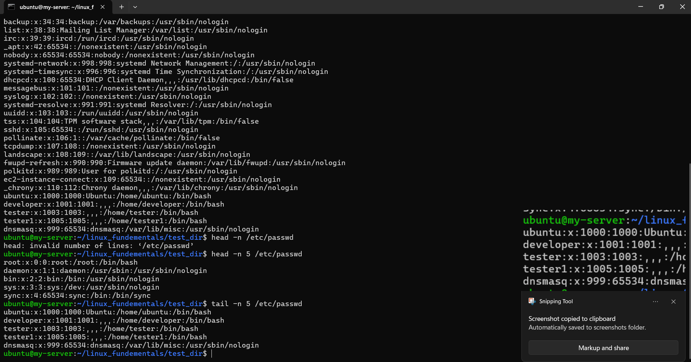
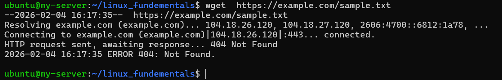
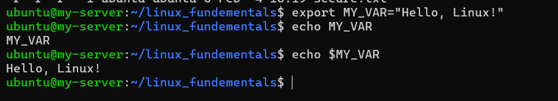

# Linux Fundamentals Practical Assignment

This repository contains the implementation of basic Linux commands as part of the **Linux Fundamentals Practical Assignment**.  
Each task includes the **commands used** along with a **clear explanation** of what each command does.

---

## 1. Creating and Renaming Files/Directories

### Commands
```bash
mkdir test_dir
cd test_dir
touch example.txt
mv example.txt renamed_example.txt
ls

```

### Explaiantion
#### 1. mkdir test_dir creates a new directory named test_dir
#### 2. cd test_dir navigates into the directory
#### 3 .touch example.txt creates an empty file
#### 4 .mv example.txt renamed_example.txt renames the file

ls lists the files inside the directory
## 2. Viewing File Contents

### Commands
```bash 
cat /etc/passwd
head -n 5 /etc/passwd
tail -n 5 /etc/passwd
```


### Explanation
#### 1.cat /etc/passwd displays the entire content of the /etc/passwd file
#### 2.head -n 5 /etc/passwd displays only the first 5 lines of the file
#### 3.tail -n 5 /etc/passwd displays only the last 5 lines of the file

## 3. Searching for Patterns Using grep

### Command
```bash 
grep "root" /etc/passwd
```


### Explaination
#### 1. grep "root" /etc/passwd searches the /etc/passwd file and displays all lines that contain the word root

## 4. Zipping and Unzipping Directories
### Commands 
```bash 
cd ..
zip -r test_dir.zip test_dir
mkdir unzipped_dir
unzip test_dir.zip -d unzipped_dir
```


### Explaiantion
#### 1.cd .. moves one directory back
#### 2.zip -r test_dir.zip test_dir compresses the test_dir directory into a zip file named test_dir.zip
#### 3.mkdir unzipped_dir creates a new directory named unzipped_dir
#### 4.unzip test_dir.zip -d unzipped_dir extracts the zip file into the unzipped_dir directory

## 5.Downloading Files Using wget
### commands
```bash
wget https://example.com/sample.txt
```


### Explaiantion
#### wget https://example.com/sample.txt downloads a file from the given URL and saves it in the current directory

## 6. Changing File Permissions
### Commands
```bash
touch secure.txt
chmod 444 secure.txt
ls -l secure.txt
```


### Explaiantion
#### touch secure.txt creates a new file named secure.txt
#### chmod 444 secure.txt changes the file permissions to read-only for owner, group, and others
#### ls -l secure.txt displays the file permissions in long listing format

## 7. Working with Environment Variables
### Commands
```bash
export MY_VAR="Hello, Linux!"
echo $MY_VAR
```


### Explaination
#### 1.export MY_VAR="Hello, Linux!" creates an environment variable named MY_VAR
#### 2.echo $MY_VAR displays the value stored in the environment variable


